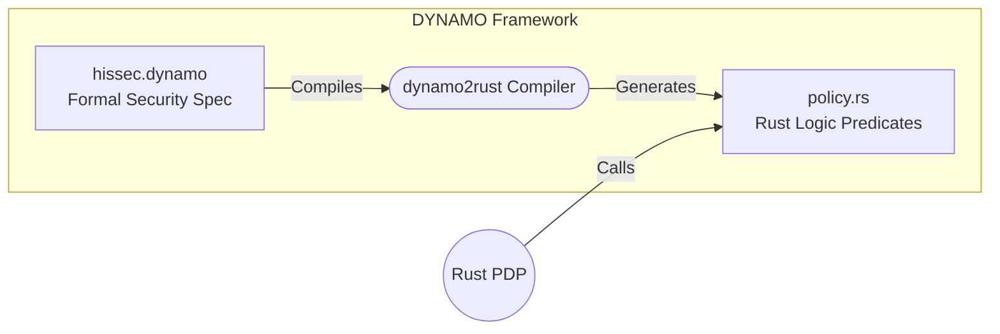

# HISSEC* - Hospital Information System Security

This project is a comprehensive Rust implementation of the HISSEC* security policy architecture. It enforces a strict Permission Matrix across hospital roles (Manager, Clerk, Physician, Nurse, Paramedic, Patient) utilizing a clean separation of Business Logic, Policy Enforcement (PEP), Policy Decision (PDP), Models, and DYNAMO-generated policies.

This document contains everything required to understand, run, and evaluate the system without needing to read the underlying source code.

---

**Team Members:**
- Jay prakashbhai Shankar (75508)
- Sujal jitubhai Savani (75240)
- Kishan Sureshbhai Rupavatiya (75643)
- Ronak Chandubhai Radadiya (75576)
- Vivek Vinodbhai Nakrani (75578)
- Devarsya Pureveshbhai Shah (75493)

## Quick Setup & Execution Commands

The project runs completely in-memory using thread-safe state and has minimal dependencies.

### 1. Interactive Terminal UI (Manual Verification)
To manually verify the system, launch the interactive REPL:
```bash
cargo run
```
This allows you to log in as specific test users and manually trigger access requests (e.g., Read EHR, Fetch Sensor, Change Ward) to see the PEP's ALLOW/DENY decisions in real-time.

### 2. Full Automated Test Suite (Rule Verification)
To rigorously verify all security rules (G1-G7, Role constraints, Ward contexts):
```bash
cargo test
```
This executes 76 unit and integration tests ensuring 100% compliance with the HISSEC* permission matrix.

---

## Interactive UI Testing Guide (Cheat Sheet)

When running `cargo run`, use the following parameters to test the system. The system is pre-seeded with these exact entities.

### Valid Usernames (For Login)
| Username | Role Assigned | System ID | Starting Ward |
| :--- | :--- | :--- | :--- |
| `ronak` | Manager | `u-mgr` | `ward-icu` |
| `sujal` | Clerk | `u-clk` | `ward-icu` |
| `devarsya` | Physician | `u-ph1` | `ward-icu` |
| `jay` | Nurse | `u-nu1` | `ward-icu` |
| `kishan` | Paramedic | `u-pa1` | `ward-icu` |
| `vivek` | Patient | `u-pt1` | `ward-icu` |
| `dr_grace` | Physician | `u-ph2` | `ward-surgery` |
| `nurse_henry` | Nurse | `u-nu2` | `ward-surgery` |
| `dr_john` | Physician | `u-ph3` | `ward-internal` |
| `nurse_emma` | Nurse | `u-nu3` | `ward-internal` |
| `patient_anna` | Patient | `u-pt2` | `ward-internal` |
| `dr_smith` | Physician | `u-ph4` | `ward-maternity` |
| `nurse_sophia` | Nurse | `u-nu4` | `ward-maternity` |
| `clerk_lisa` | Clerk | `u-clk2` | `ward-maternity` |
| `patient_mia` | Patient | `u-pt3` | `ward-maternity` |

### Valid Input Parameters
When the UI prompts you for specific IDs to interact with, use these exact values:

*   **Roles:** `manager`, `clerk`, `physician`, `nurse`, `paramedic`, `patient`
*   **Target User IDs (For Change Ward/Assign Role):** `u-mgr`, `u-clk`, `u-ph1`, `u-nu1`, `u-pa1`, `u-pt1`, `u-ph2`, `u-nu2`, `u-ph3`, `u-nu3`, `u-pt2`, `u-ph4`, `u-nu4`, `u-clk2`, `u-pt3`
*   **Ward IDs:** `ward-icu`, `ward-surgery`, `ward-internal`, `ward-maternity`
*   **EHR IDs:** `ehr-001` (in ICU), `ehr-002` (in Surgery), `ehr-003` (in Internal), `ehr-004` (in Maternity)
*   **Sensor IDs:** `sen-icu-normal`, `sen-icu-critical`, `sen-surg-normal`, `sen-int-normal`, `sen-int-critical`, `sen-mat-normal`
*   **Password:** `password` (Global password for all seeded accounts)

### Example Manual Test: Paramedic Deny Scenario
1. Choose `1` (Login). Username: `kishan`, Password: `password`, Role: `paramedic`.
2. Choose `4` (Fetch Sensor). Sensor ID: `sen-icu-normal`.
3. **Result:** `[FAIL] DENY: Paramedic may only fetch Critical sensors`

---

## Architecture Diagrams

The system strictly enforces that no business service accesses data directly. All requests pass through the PEP, which consults the PDP, which evaluates the DYNAMO logic.

### 1. Execution Workflow (PDP/PEP)

```mermaid
flowchart TD
    User([User Request])
    
    subgraph BusinessLogic["Business Logic"]
        Service[Service Layer<br/>Auth / EHR / Sensor / Ward]
    end
    
    subgraph SecurityLayer["Security Layer"]
        PEP{PEP<br/>Policy Enforcement Point}
        PDP[[PDP<br/>Policy Decision Point]]
        Audit[G7 Audit Logger]
    end
    
    subgraph Repositories["Repositories"]
        Repo[(In-Memory Repositories<br/>CRUD)]
    end
    
    subgraph DYNAMO["DYNAMO"]
        DynamoRules[generated/policy.rs<br/>DYNAMO Predicates]
    end
    
    User -->|1. Request| Service
    Service -->|2. Calls enforce()| PEP
    PEP -->|3. PolicyRequest Snapshot| PDP
    PDP -->|4. Evaluates Rule| DynamoRules
    DynamoRules -->|5. Allow / Deny| PDP
    PDP -->|6. PolicyResponse| PEP
    PEP -->|7. Log Decision| Audit
    PEP -->|8. If ALLOW| Repo
    Repo -->|9. Data| Service
    PEP -->|8. If DENY| Service
    Service -->|10. Final Response| User
```
    
### 2. DYNAMO Integration Map



### 3. Hospital State Map

```mermaid
flowchart TD
    subgraph ICU["Ward: ICU (ward-icu)"]
        subgraph ICU_Users["Users"]
            U_MGR["ronak (u-mgr)<br/>Role: Manager"]
            U_PH1["devarsya (u-ph1)<br/>Role: Physician"]
            U_NU1["jay (u-nu1)<br/>Role: Nurse"]
            U_PA1["kishan (u-pa1)<br/>Role: Paramedic"]
            U_PT1["vivek (u-pt1)<br/>Role: Patient"]
        end
        subgraph ICU_Assets["Assets"]
            EHR1["ehr-001<br/>Type: EHR"]
            SEN1["sen-icu-normal<br/>Type: Normal Sensor"]
            SEN2["sen-icu-critical<br/>Type: Critical Sensor"]
        end
    end

    subgraph SURGERY["Ward: Surgery (ward-surgery)"]
        subgraph SURG_Users["Users"]
            U_PH2["dr_grace (u-ph2)<br/>Role: Physician"]
            U_NU2["nurse_henry (u-nu2)<br/>Role: Nurse"]
        end
        subgraph SURG_Assets["Assets"]
            EHR2["ehr-002<br/>Type: EHR"]
            SEN3["sen-surg-normal<br/>Type: Normal Sensor"]
        end
    end

    subgraph INTERNAL["Ward: Internal (ward-internal)"]
        subgraph INT_Users["Users"]
            U_PH3["dr_john (u-ph3)<br/>Role: Physician"]
            U_NU3["nurse_emma (u-nu3)<br/>Role: Nurse"]
            U_PT2["patient_anna (u-pt2)<br/>Role: Patient"]
        end
        subgraph INT_Assets["Assets"]
            EHR3["ehr-003<br/>Type: EHR"]
            SEN4["sen-int-normal<br/>Type: Normal Sensor"]
            SEN5["sen-int-critical<br/>Type: Critical Sensor"]
        end
    end

    subgraph MATERNITY["Ward: Maternity (ward-maternity)"]
        subgraph MAT_Users["Users"]
            U_PH4["dr_smith (u-ph4)<br/>Role: Physician"]
            U_NU4["nurse_sophia (u-nu4)<br/>Role: Nurse"]
            U_CLK2["clerk_lisa (u-clk2)<br/>Role: Clerk"]
            U_PT3["patient_mia (u-pt3)<br/>Role: Patient"]
        end
        subgraph MAT_Assets["Assets"]
            EHR4["ehr-004<br/>Type: EHR"]
            SEN6["sen-mat-normal<br/>Type: Normal Sensor"]
        end
    end
```



---

## Complete File Structure & Detailed Use Cases

Below is the exhaustive mapping of every file in the project and its exact responsibility in enforcing the HISSEC* architecture.

```text
hospital-hissec/
|
|-- Cargo.toml                  # Rust manifest. Uses minimal dependencies (serde) to ensure compatibility.
|-- README.md                   # This comprehensive documentation file.
|
|
|-- policy/
|   |-- hissec.dynamo           # The raw, formal DYNAMO security specification rules.
|   |-- generated/
|       |-- policy.rs           # Auto-generated Rust boolean predicates output by dynamo2rust.
|
|-- src/
    |-- main.rs                 # Entry Point. Runs the Interactive Terminal UI loop.
    |
    |-- config/
    |   |-- mod.rs              # App-wide configurations (app name, versions).
    |
    |-- errors/
    |   |-- policy_error.rs     # Standardized AppError types (PolicyDenied, NotFound, etc.).
    |
    |-- models/                 # Domain Entities (Pure Data Structures)
    |   |-- ehr.rs              # Electronic Health Record.
    |   |-- enums.rs            # Core Enums: RoleKind (Manager, Clerk, etc.), SensorType (Normal, Critical).
    |   |-- role.rs             # Role entity.
    |   |-- sensor.rs           # Sensor entity.
    |   |-- subject.rs          # Represents an active user session/token.
    |   |-- user_role.rs        # Mapping entity connecting Users to Roles.
    |   |-- user.rs             # User identity entity.
    |   |-- ward.rs             # Ward contextual boundary (ICU, Surgery, etc.).
    |
    |-- storage/                # In-memory repositories (Permission-Blind CRUD)
    |   |-- ehr_repository.rs   # CRUD for EHRs.
    |   |-- sensor_repository.rs# CRUD for Sensors.
    |   |-- subject_repository.rs # Tracks active Login Sessions.
    |   |-- user_repository.rs  # User and role assignments CRUD.
    |   |-- ward_repository.rs  # Ward lookups.
    |
    |-- policy/                 # Security / Access Control Core
    |   |-- pdp.rs              # Policy Decision Point: Pure, stateless rule evaluator.
    |   |-- pep.rs              # Policy Enforcement Point: The absolute gatekeeper for all requests.
    |   |-- requests.rs         # Data Transfer Objects (DTOs) packaging state sent from PEP -> PDP.
    |   |-- responses.rs        # Allow/Deny payload responses returned from PDP -> PEP.
    |   |-- rules.rs            # The bridging logic mapping system operations to generated/policy.rs.
    |
    |-- services/               # Business Logic Layer (Must pass through PEP)
    |   |-- app_state.rs        # Global thread-safe state (Mutex) AND the Default Seed Data definitions.
    |   |-- auth_service.rs     # Login/Logout logic. Checks PEP, creates Subject sessions.
    |   |-- ehr_service.rs      # EHR creation/reading. Checks PEP before accessing ehr_repository.
    |   |-- sensor_service.rs   # Sensor retrieval. Checks PEP before accessing sensor_repository.
    |   |-- user_service.rs     # User management (assign role, change ward). Checks PEP.
    |   |-- ward_service.rs     # Ward retrieval logic.
    |
    |-- utils/                  # System Utilities
    |   |-- helpers.rs          # Secure password hashing and deterministic unique ID generation.
    |   |-- logger.rs           # Audit Logger. Required to fulfill rule G7 (Prints every decision).
    |
    |-- tests/                  # Comprehensive Test Suite (76 total tests)
        |-- ehr_tests.rs        # Verifies EHR permissions limits (e.g., cross-ward denies).
        |-- integration_tests.rs# Multi-step complex workflow tests (e.g., Login -> Assign -> Act).
        |-- login_tests.rs      # Verifies Authentication rules (Unknown users, invalid roles).
        |-- policy_tests.rs     # Direct unit tests invoking the PDP directly without business logic.
        |-- sensor_tests.rs     # Verifies Paramedic/Physician/Nurse sensor access constraints.
```

---

## Security Guarantees & Rule Verification

The architecture mathematically guarantees the following constraints defined in the assignment:

| Rule | Description | How it is Enforced | Verification Test Name |
| :--- | :--- | :--- | :--- |
| **G1** | User must exist | `AuthService` rejects unknown usernames before PEP processing. | `login_unknown_user_denies` |
| **G2** | Session must be active | PEP verifies `Subject` exists in `SubjectRepository` for all ops. | `g2_no_session_denies_read_ehr` |
| **G3** | Active role assigned | PDP verifies `Subject.active_role` matches operation allowed roles. | `g3_invalid_role_denies` |
| **G4** | Target object exists | PEP fetches target object from Repositories; denies if `None`. | `read_nonexistent_ehr` |
| **G5** | Valid session for action | Inherently covered by PEP session tracking and PDP evaluation. | `scenario_session_invalid_after_logout` |
| **G6** | Ward must exist | PEP verifies `Ward` exists before allowing user moves or EHR creation. | `add_user_invalid_ward_denies` |
| **G7** | Every decision logged | The `PEP.enforce()` method *hardcodes* a call to `AuditLogger.log()`. | Verified manually in `stdout`. |
| **Role A**| Physician/Nurse Sensors| PDP checks if `Requester.Ward == Target.Ward`. | `physician_fetches_sensor_different_ward_denies` |
| **Role B**| Paramedic Sensors | PDP checks if `SensorType == Critical`. | `paramedic_fetches_normal_sensor_denies` |
